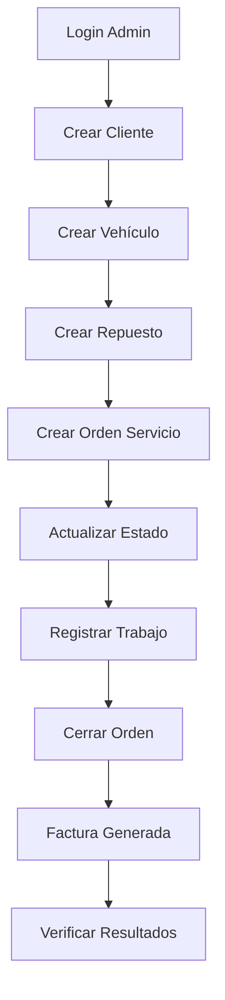

# 🧪 Guía de Pruebas - AutoTallerManager API

## 📋 **Resumen**

Esta guía te ayudará a probar todos los endpoints de la API AutoTallerManager en el orden correcto y de forma sistemática.

## 🚀 **Inicio Rápido**

### **1. Preparar el Entorno**

```bash
# 1. Iniciar la base de datos
cd /home/raucrow/jc2dev/AutoTallerManager
docker-compose -f docker/docker-compose.yml up -d

# 2. Aplicar migraciones
dotnet ef database update --project AutoTallerManager.Infrastructure --startup-project AutoTallerManager.API

# 3. Poblar datos iniciales
psql -h localhost -p 5433 -U postgres -d autotallerdb -f AutoTallerManager.Infrastructure/Persistence/Scripts/SeedData.sql

# 4. Iniciar la API
dotnet run --project AutoTallerManager.API
```

### **2. Ejecutar Pruebas Automatizadas**

```bash
# Ejecutar script de pruebas completo
./test_endpoints.sh
```

## 📖 **Métodos de Prueba**

### **🔧 Opción 1: Script Automatizado (Recomendado)**

El script `test_endpoints.sh` ejecuta todas las pruebas en orden:

```bash
./test_endpoints.sh
```

**Características:**
- ✅ Pruebas automáticas en orden correcto
- ✅ Manejo de tokens automático
- ✅ Validación de respuestas
- ✅ Pruebas de rate limiting
- ✅ Reporte de resultados

### **📱 Opción 2: Postman Collection**

Importa `AutoTallerManager.postman_collection.json` en Postman:

1. Abre Postman
2. Importa la colección
3. Configura la variable `baseUrl` a `http://localhost:5000`
4. Ejecuta las carpetas en orden

**Características:**
- ✅ Interfaz gráfica intuitiva
- ✅ Variables automáticas
- ✅ Tests automáticos
- ✅ Documentación integrada

### **🌐 Opción 3: Swagger UI**

Accede a `http://localhost:5000/swagger`:

1. Haz clic en "Authorize"
2. Introduce: `Bearer {tu_token}`
3. Prueba los endpoints manualmente

**Características:**
- ✅ Interfaz web integrada
- ✅ Documentación interactiva
- ✅ Pruebas manuales
- ✅ Esquemas de datos

### **💻 Opción 4: Guía Manual**

Sigue la guía detallada en `GUIA_PRUEBAS_ENDPOINTS.md`:

```bash
# Ver la guía completa
cat GUIA_PRUEBAS_ENDPOINTS.md
```

## 🔐 **Credenciales por Defecto**

| Usuario | Email | Password | Rol |
|---------|-------|----------|-----|
| admin | admin@autotaller.com | admin123 | Admin |

## 📊 **Orden de Pruebas Recomendado**

### **Fase 1: Preparación**
1. ✅ Verificar conexión API
2. ✅ Login como administrador
3. ✅ Obtener token JWT

### **Fase 2: Catálogos**
4. ✅ Consultar tipos de cliente
5. ✅ Consultar tipos de vehículo
6. ✅ Consultar marcas y modelos
7. ✅ Consultar tipos de servicio

### **Fase 3: Datos Maestros**
8. ✅ Crear cliente
9. ✅ Crear vehículo
10. ✅ Crear repuesto

### **Fase 4: Operaciones Principales**
11. ✅ Crear orden de servicio
12. ✅ Actualizar estado de orden
13. ✅ Registrar trabajo realizado
14. ✅ Cerrar orden (genera factura)

### **Fase 5: Verificación**
15. ✅ Consultar factura generada
16. ✅ Verificar estadísticas
17. ✅ Probar rate limiting

## 🎯 **Flujo de Negocio Completo**



## ⚠️ **Errores Comunes**

### **Error 401 Unauthorized**
```bash
# Solución: Hacer login nuevamente
curl -X POST http://localhost:5000/api/Usuario/login \
  -H "Content-Type: application/json" \
  -d '{"email": "admin@autotaller.com", "password": "admin123"}'
```

### **Error 403 Forbidden**
```bash
# Solución: Verificar que el usuario tenga permisos de Admin
# El usuario admin tiene todos los permisos por defecto
```

### **Error 429 Too Many Requests**
```bash
# Solución: Esperar el tiempo especificado
# Rate limits:
# - Órdenes: 60 req/min
# - Repuestos: 30 req/min
# - Auth: 10 req/min
# - Facturas: 20 req/min
```

### **Error 400 Bad Request**
```bash
# Solución: Verificar formato JSON y campos requeridos
# Ejemplo de cliente válido:
{
  "nombre": "Juan",
  "apellido": "Pérez",
  "telefono": "3001234567",
  "email": "juan@email.com",
  "tipoClienteId": 1
}
```

## 🔍 **Verificación de Resultados**

### **Datos Esperados Después de las Pruebas**

```sql
-- Verificar que se crearon los registros
SELECT COUNT(*) FROM "Clientes" WHERE "Email" = 'juan.perez@email.com';
SELECT COUNT(*) FROM "Vehiculos" WHERE "VIN" = '1HGBH41JXMN109186';
SELECT COUNT(*) FROM "Repuestos" WHERE "CodigoRepuesto" = 'FIL-002';
SELECT COUNT(*) FROM "OrdenesServicio" WHERE "DescripcionTrabajo" LIKE '%Mantenimiento%';
SELECT COUNT(*) FROM "Facturas" WHERE "Observaciones" LIKE '%completado%';
```

### **Logs de Auditoría**

```sql
-- Verificar que se registraron las operaciones
SELECT "Entidad", "Accion", "CreatedAt" 
FROM "Auditorias" 
ORDER BY "CreatedAt" DESC 
LIMIT 10;
```

## 📈 **Métricas de Rendimiento**

### **Tiempos Esperados**
- Login: < 500ms
- Consultas simples: < 200ms
- Creación de entidades: < 1s
- Operaciones complejas: < 2s

### **Rate Limiting**
- Órdenes de Servicio: 60 req/min
- Repuestos: 30 req/min
- Autenticación: 10 req/min
- Facturas: 20 req/min
- Global: 100 req/min

## 🛠️ **Herramientas de Debugging**

### **Logs de la API**
```bash
# Ver logs en tiempo real
dotnet run --project AutoTallerManager.API --verbosity detailed
```

### **Logs de Base de Datos**
```bash
# Conectar a PostgreSQL
psql -h localhost -p 5433 -U postgres -d autotallerdb

# Ver logs de auditoría
SELECT * FROM "Auditorias" ORDER BY "CreatedAt" DESC LIMIT 20;
```

### **Verificar Estado de la Base de Datos**
```bash
# Ejecutar script de verificación
psql -h localhost -p 5433 -U postgres -d autotallerdb -f AutoTallerManager.Infrastructure/Persistence/Scripts/VerifyDatabase.sql
```

## 📚 **Recursos Adicionales**

- 📖 **Guía Completa**: `GUIA_PRUEBAS_ENDPOINTS.md`
- 🤖 **Script Automatizado**: `test_endpoints.sh`
- 📱 **Colección Postman**: `AutoTallerManager.postman_collection.json`
- 🌐 **Swagger UI**: `http://localhost:5000/swagger`
- 🗄️ **Scripts SQL**: `AutoTallerManager.Infrastructure/Persistence/Scripts/`

## 🎉 **¡Listo para Probar!**

Con esta guía tienes todo lo necesario para probar completamente la API AutoTallerManager. 

**Recomendación**: Comienza con el script automatizado (`./test_endpoints.sh`) para una experiencia completa y luego usa Postman o Swagger para pruebas específicas.

¡Disfruta probando tu API! 🚀
